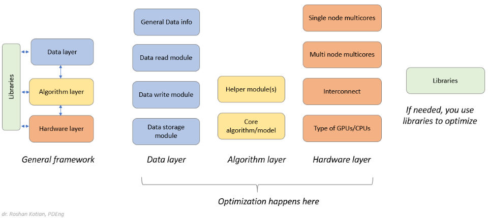
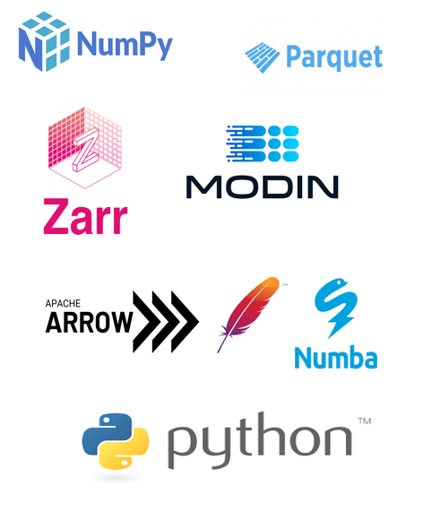

# Python code optimization workshop

Python code optimization workshop. Techniques to use the computing resources efficiently.

<!-- more -->

### User stories

Scenarios like the one depicted above are common. Researchers tend to reserve more computing
resources than required and in some cases request for more resources without truly understanding
the importance of refactoring the code. Achieving scalability by adding more resources is not an
efficient way of scaling your application.

<blockquote style="text-align: center;">“Code that can efficiently utilize the computing resources is the best costeffective way to scale up”</blockquote>

### Goal

Python code is 57 times slower than C++ and 45 worse for the planet. This two-day workshop will
provide you with hands-on knowledge on optimizing your Python code.
Optimizing the code can be a daunting task if you don’t have a clear roadmap or a framework. The
figure 1 below will be our map of the world of optimization. You’ll learn how we can take a modular
approach to optimizing your code using libraries shown in figure 2. In addition, you’ll be introduced to
a set of checklists or a sort of questionnaire that will spark curiosity and assist you in writing efficient
code.
At the end of this workshop, you’ll receive a workshop completion certificate.

<figure markdown>
  
  <figcaption>Figure 1: Framework for code optimization</figcaption>
</figure>

<figure markdown>
  
  <figcaption>Figure 2: Libraries to optimize</figcaption>
</figure>

### Requirements
Zeal to learn and basic Python knowledge is all that is needed to complete this workshop. Although
50% of the modules covered in this workshop are programming language agnostic, it will help if you
have very basic Python knowledge.

### Target audience
This workshop will greatly benefit all levels (undergraduates, Masters, and PhDs) of students who need
to optimize their code to run faster with fewer computing resources in any infrastructure(SURF,
Rescale) that the HPC lab provides.

### Modules description
This workshop will have 10 modules. Each module is independent of the others.

#### Module 1: Motivation
In this introductory module, you’ll learn the importance of code optimization. It also briefly talks about
the mindset needed for code optimization.

#### Module 2: Layered approach to code optimization
In this module, we deep dive into the framework shown in Figure 1 above. For each module and layer
within it, we will go through a checklist that will aid you in revealing the problem areas at the
architectural level of your application or will motivate you to refactor your code. Furthermore, we will
also learn how third-party libraries can greatly speed up your code.

#### Module 3: It’s all about data
Generally, we are more focused on hardware or the components of our applications and neglect to get
an overview of our data.
In this module, we will know how important it is to know the nature of the data that our application
will process. We will get hands-on knowledge on how simple data processing may reduce the
computing need. We will also acquire high-level knowledge of various big data file formats and the
pros and cons of each file format.

#### Module 4: Profiling the code
In this module, we will go through some real-world and simulated data use cases and we will detect
the performance bottleneck of the application that processes these data.
We will see how simple code refactoring can reduce computing needs. We will perform line-by-line
memory and CPU profiling. After the simple example, we will apply the concept of memory and CPU
profiling for intensive workloads.
We will use third-party libraries and pure Python programming language inbuilt profilers to check the
issues in the application that processes the data.

#### Module 5: Hardware layer
This module will provide a basic understanding of processors, and physical and logical CPUs. We will
also briefly touch upon different types of processors and how clock rate can speed up your code.
Furthermore, we will see the merits and demerits of the clock rate.
We will see some of the major differences between CPUs and GPUs. We will discuss when is it a good
idea to use GPU and what you should look for in the GPU.
We will also learn how to use Nvidia and other CPU performance monitoring commands to check how
much computing resources the application is utilizing.

#### Module 6: Data Access layer
This module will provide hands-on knowledge on parallelizing the read operation. We will see how we
can convert the CSV or Excel file to other big data file formats, benchmark their performance, and find
the best-performing file formats.
When you have large files that don’t fit the memory, then normal read operation is not the right
approach. To overcome the limitation of low RAM, the chunk reading architecture and memory
mapping of the files will be discussed.
Many techniques to speed up the data analysis process using third-party libraries will also be
discussed.

#### Module 7: Basic code optimization
This module teaches simple quick code optimization techniques, we will look into data structures such
as ‘list’, and ‘dict’ and check which one is the best by looking at their performance. The concept of
lazy programming will be shown. Supercharging ‘for’ loops; the difference between multithreading
and multiprocessing; their pros and cons and how to use these concepts in Python will be discussed in
depth.

#### Module 8: Advanced code optimization
NumPy can greatly improve performance and in some cases, they may not. Combining the NumPy and
NumExpr can help in fast processing of the expression This module will show you all these concepts.
The concept of memoization is also addressed.

#### Module 9: Matrix multiplication
Matrix multiplication is the biggest computing task and the basis for all machine learning algorithms,
we will implement matrix multiplication of various sizes using NumPy and other libraries and
benchmark their performance. All these concepts will be discussed in this module.

#### Module 10: Data storage layer
In this module, basic compression techniques will be highlighted, we will learn how to persist large
arrays with Zarr and get the basic knowledge of Blosc for efficient data storage. Implementing chunk
writing is also addressed here.
