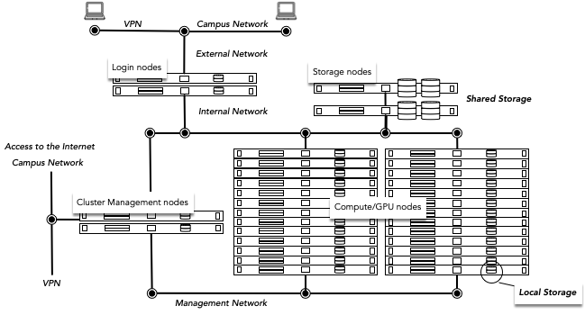

# Access the cluster

<figure markdown style="float: right">
  { width=350px }
  <figcaption>Infrastructure Overview</figcaption>
</figure>

The TU/e Umbrella HPC Cluster operates on a Linux platform that can be accessed by your browser on [hpc.tue.nl](https://hpc.tue.nl){:target=_blank} or through SSH at `hpc.tue.nl`.
The cluster is restricted to users on the TU/e campus network. To connect from an external location, you'll need to use a VPN connection. Detailed instructions on setting up the VPN are available on the [intranet](https://tuenl.sharepoint.com/sites/intranet-LIS/SitePages/New-VPN-Service--eduVPN.aspx){:target=_blank}.

There are currently two methods to connect to the TU/e HPC Umbrella Cluster, either through a website using [Open Ondemand](openondemand.md), or through [SSH](ssh/index.md).

*[VPN]: Virtual Private Network
