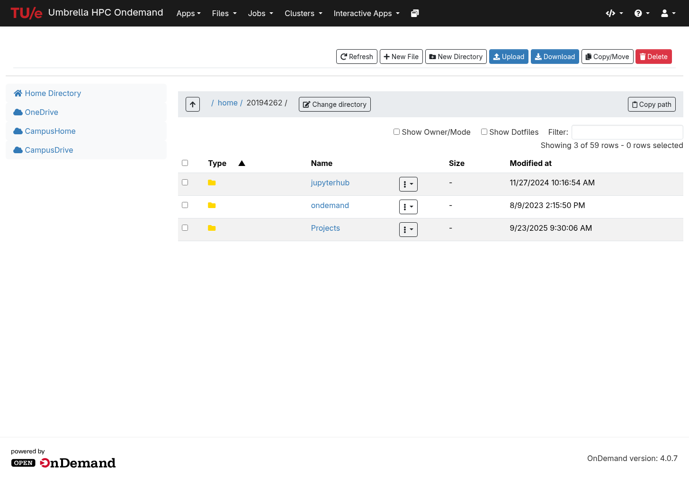
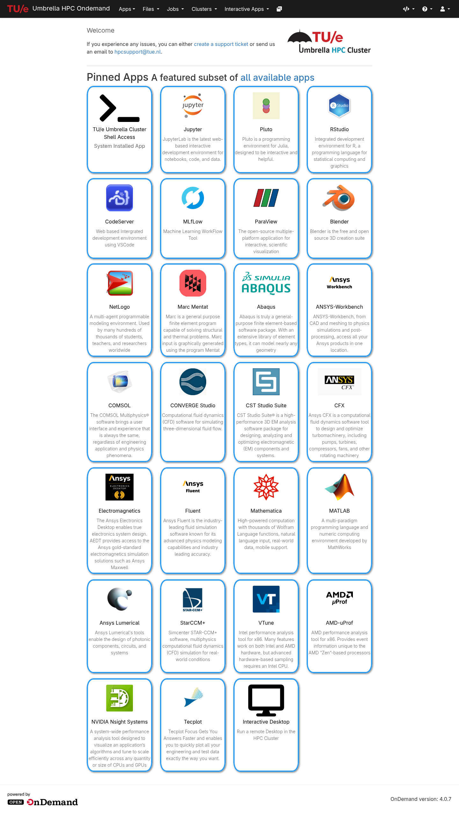
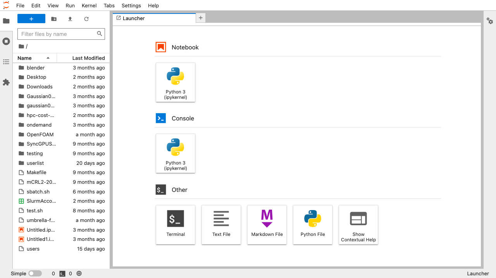
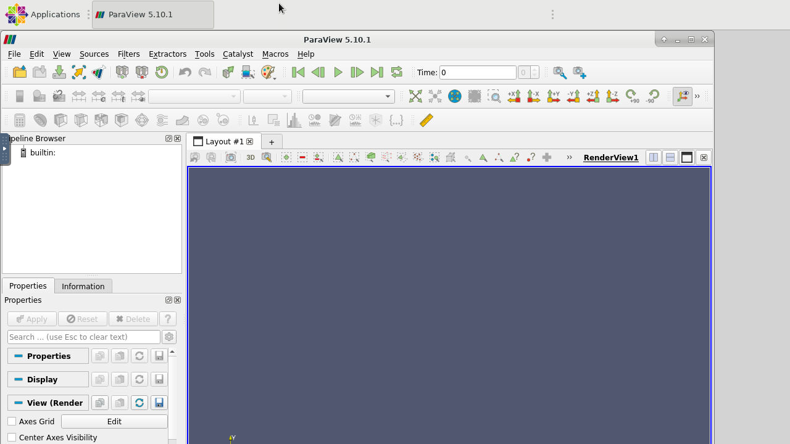
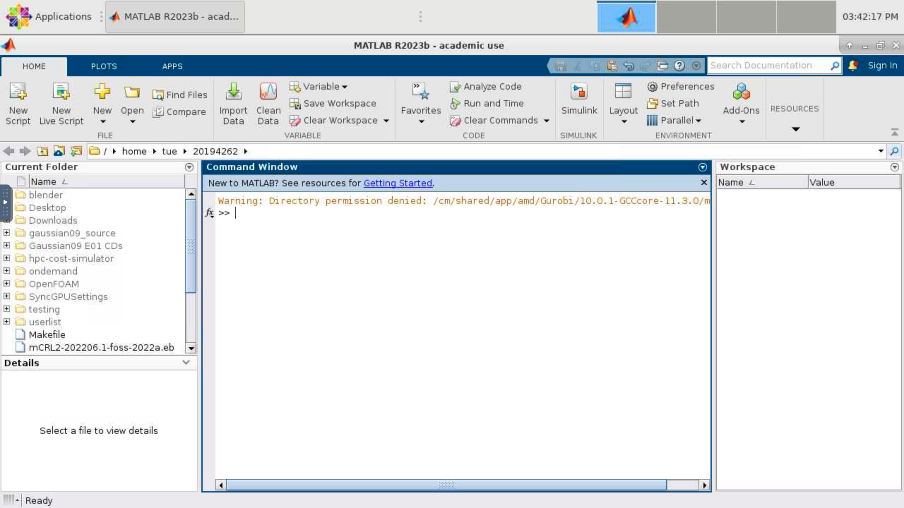
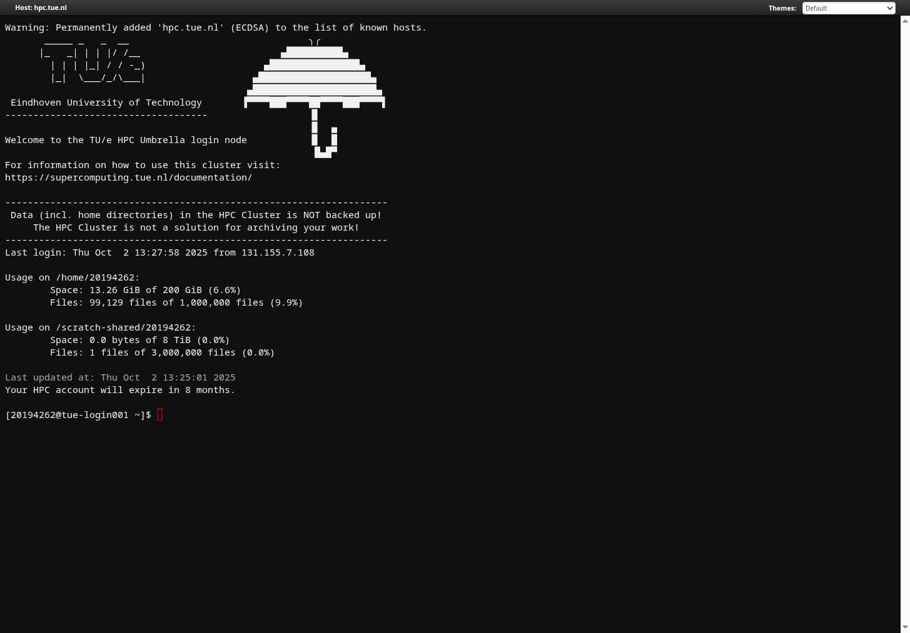
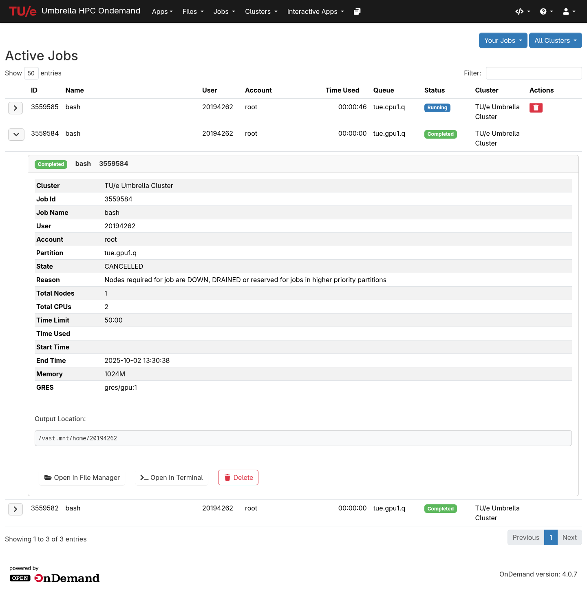

# Open OnDemand

To access to the TU/e Umbrella HPC Cluster using a web browser, visit [hpc.tue.nl](https://hpc.tue.nl){:target=_blank} and login with your TU/e credentials.

## Upload, Download and edit Files

{ align=right width=250px }
Access to the files with edit, upload and download capabilities, in your home-directory on the cluster via the browser. In addition you can [configure OneDrive](../data/onedrive.md) to be available for easy file transfer.

## Interactive Graphical Jobs

{ align=right width=250px }
Start interactive jobs in your browser with a few clicks and interact within your browser.

{ width=200px }
{ width=200px }
{ width=200px }

Various examples with Jupyter, ParaView and Matlab respectively

## Terminal in the Browser

{ align=right width=250px }
Terminal access to the cluster login-node available from the browser, no longer client software is needed (other than a modern web browser) to take your first steps on the cluster!

## Job Status

{ align=right width=250px }
Show detailed information about your running, and recently completed jobs.

---

{: style="height:30px"}

:   The TU/e Umbrella HPC cluster uses [Open OnDemand](https://openondemand.org/) for remote web access.
