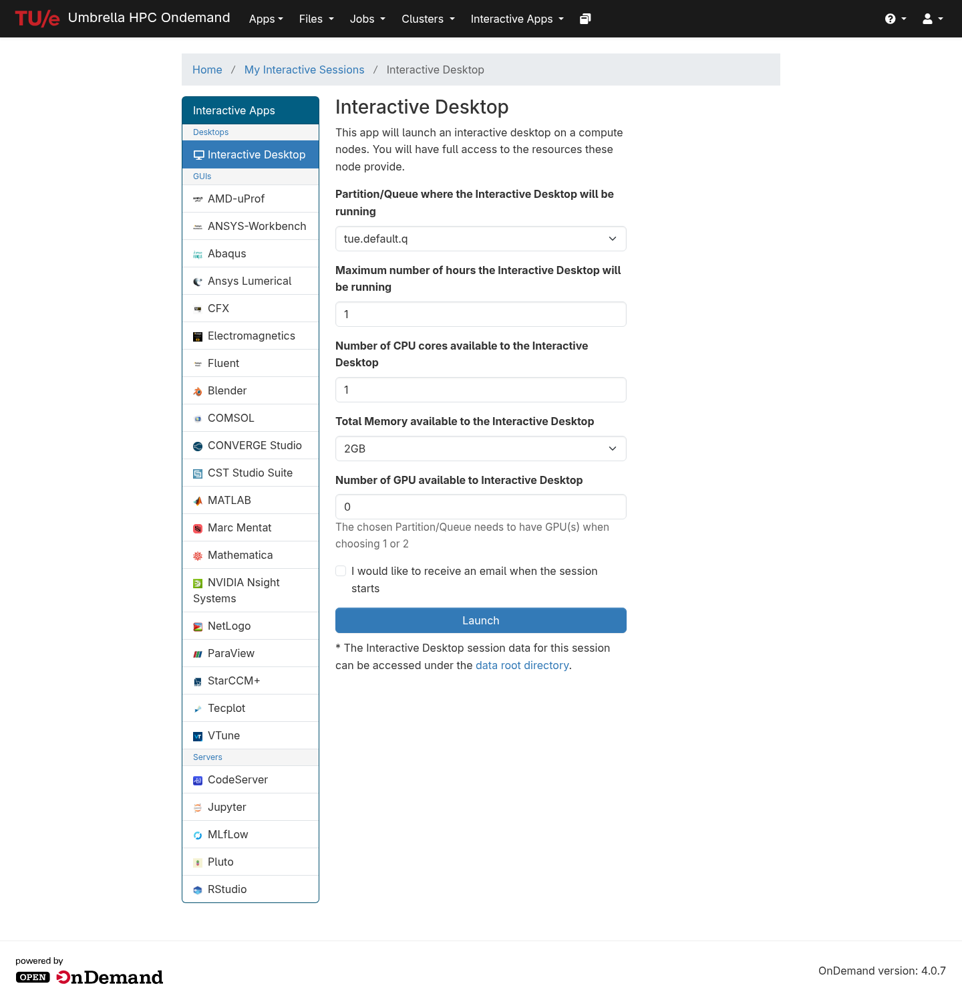
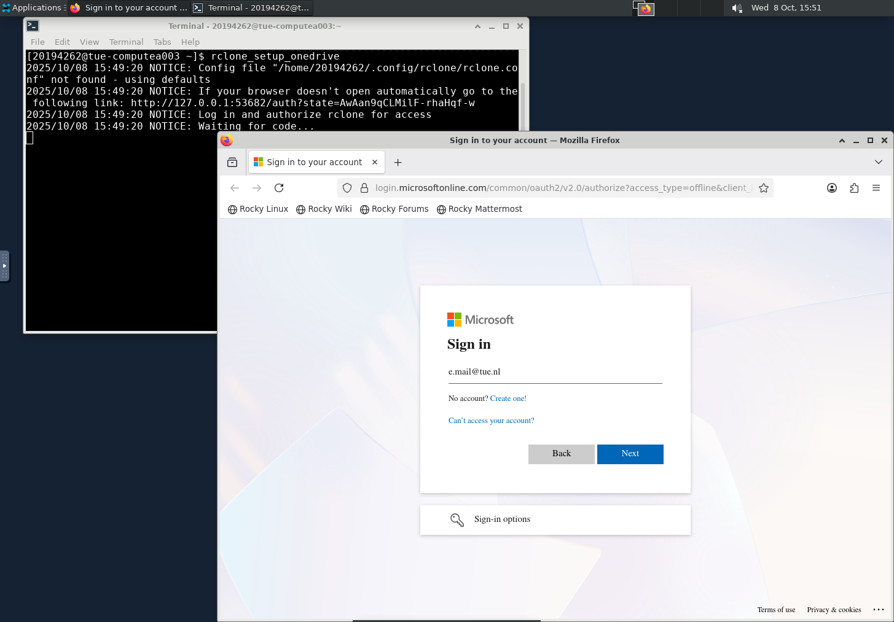

# Microsoft OneDrive

This page will describe how you can configure and use [Microsoft OneDrive](https://onedrive.microsoft.com){:target=_blank} within the TU/e Umbrella HPC Cluster.

## Configuration

A **_one-time_** setup is required to configure OneDrive for your TU/e Umbrella HPC account. This needs to be done through an interactive desktop session.

### 1. Start an interactive Desktop Session

{ align=right width=250px }

Login into the webinterface of [hpc.tue.nl](https://hpc.tue.nl) and request an [Interactive Desktop](https://hpc.tue.nl/pun/sys/dashboard/batch_connect/sys/desktop/session_contexts/new){:target=_blank} (Scroll Down to the bottom of the list of Tiles).

Any available queue will do, if unsure choose: **tue.default.q**.

1 hour, 1 CPU and 2 GB of memory should be sufficient to finish the configuration.
Please do **NOT** request a GPU for this interactive session.

Open the desktop session once the interactive desktop session is ready and continue to the next step.

<div style="clear: both" markdown></div>

### 2. Setting up a connection to OneDrive

{ align=right width=250px }

Start up the terminal within the desktop session, and run the following command:

```shell
rclone_setup_onedrive # (1)!
```

1.  This effectively runs the following command:
    ```shell
    rclone --config=~/.config/rclone/rclone.conf config create --onedrive-drive-id=1 --onedrive-drive-type=business --onedrive-region=global OneDrive onedrive
    ```

A web browser window should pop up allowing you to log in with your TU/e credentials. If everything went well you should
now see: **Success!** - _All done. Please go back to rclone._

You can now close all windows and end the desktop session (left-click on your name in the upper right corner, choose _"Log Out..."_ and then the press _"Log Out"_ button).

### 3. Validate Configuration

If everything went well OneDrive should now be visible in [Open OnDemand > Files](https://hpc.tue.nl/pun/sys/dashboard/files/){:target=_blank}, or in [SSH](../access/ssh/index.md):
```shell
rclone ls OneDrive:
```

If this is not the case, please try again starting from [step 1](#1-start-an-interactive-desktop-session).
Please [contact us](../../../contact.md) if you keep running into issues or require further assistance.

## Usage

Ensure that OneDrive is [configured correctly](#3-validate-configuration).
The [Open OnDemand](../access/openondemand.md) environment on [hpc.tue.nl](https://hpc.tue.nl){:target=_blank} should be self-explanatory for most users. For [SSH](../access/ssh/index.md#logging-in), command line see the command examples below:

In general we'd suggest to use the built-in help command from [`rclone`](https://rclone.org/docs/){:target=_blank}:
```shell
rclone --help
rclone ls --help
```

### Listing Files

```shell
# Usage
rclone ls OneDrive:[path]

# Example, List all files
rclone ls OneDrive:

# Example, List all files within path
rclone ls OneDrive:Projects/Example
```

### Copy Files

Create an empty hello.txt file and upload it to OneDrive using `rclone copy` as below in a terminal:

``` shell
touch hello.txt
rclone copy hello.txt OneDrive:/test
```

This creates a toplevel directory in OneDrive called 'test' if it does not already exist, and uploads the file hello.txt to it.

To verify the uploading is successful, you can either login to OneDrive in a web browser to check the file, or use rclone ls command in the terminal as:

``` shell
rclone ls OneDrive:/test
```

Copy the contents of a source directory from a configured OneDrive remote: `OneDrive:/src/dir/path`, into a destination directory: `/dest/dir/path`, using the code below:

``` shell
rclone copy OneDrive:/src/dir/path /dest/dir/path
```

Identical files on the source and destination directories are not transferred. Only the contents of the provided source directory are copied, not the directory name and contents.

copy does not delete files from the destination. To delete files from the destination directory in order to match the source directory, use the sync command instead.

If only one file is being transferred, use the copyto command instead:

``` shell
rclone copyto OneDrive:/test/hello.txt test-onedrive.txt
```

!!! danger "Avoid the usage of `rclone mount`"

    This can lead to unexpected behavior and is often missunderstood as such will only be available on the node you're currently logged into.
