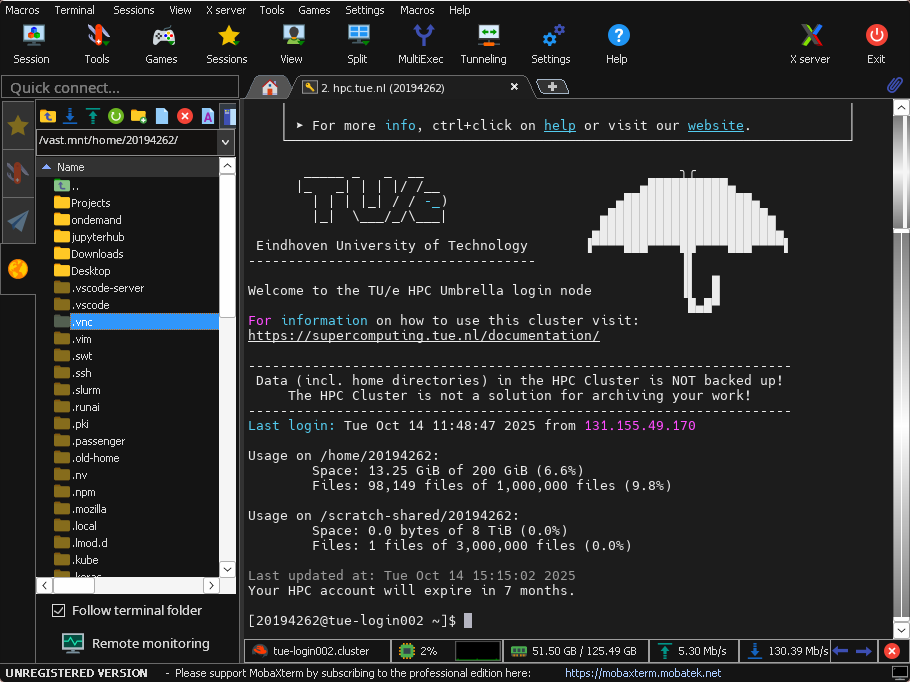
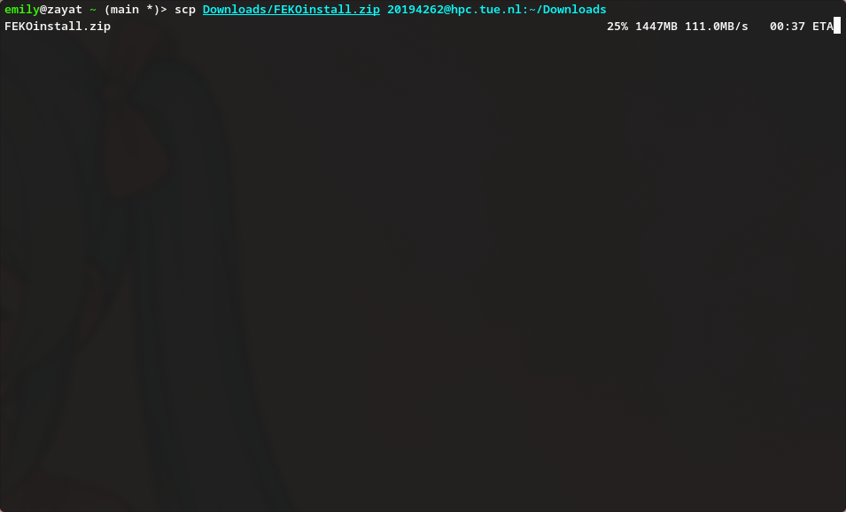

# Local System

This page will describe how you can copy files to the TU/e Umbrella HPC Cluster from your local system (and vice versa).

## Transferring Data

### Open OnDemand

{ align=right width=250px }

The easiest to use solution we offer is to use the web interface on [hpc.tue.nl](https://hpc.tue.nl/pun/sys/dashboard/files/){:target=_blank}, where you can drag/drop files from your local system to/from the cluster.
This is option is however limited to a limited amount of files and directories or total size.

If you need to transfer large or many files, or prefer the command line, please read below for alternative options.

<div style="clear: both"></div>

### MobaXterm

{ align=right width=250px }

[MobaXterm](../access/ssh/index.md#required-software) is one of our supported methods to connect to the TU/e Umbrella
HPC Cluster which provides a mixture of a GUI and command line for Windows users.

Once you're logged into the cluster on hpc.tue.nl, a file browser will be available on the left-side of the terminal.
The contents of this sidebar represents the files/directories on the cluster.

You can simply drag/drop files to transfer files between your system and the HPC cluster.

<div style="clear: both"></div>

### SCP

{ align=right width=250px }

The `scp` command is part of [SSH](../access/ssh/index.md#required-software), and in most cases and doesn't require a
separate installation on Linux, MacOSX and recent versions of Windows (10+).

We assume you already connected at least once to the HPC cluster using SSH. For this method we highly encourage to
configure [passwordless authentication](../access/ssh/index.md#passwordless-authentication) first.

1. Identify Your Files and Destination
    - **Source file**: Know the full path of the file you want to transfer, e.g.
      `C:\Users\YourName\Documents\example.txt`
    - **Destination path**: Determine the destination folder on the server, e.g.
      `/home/yourusername/`

2. Open a terminal/command prompt
    - For windows, press `Win + R`, and type `cmd` or `powershell`, and hit Enter.

3. Run the SCP Command
   Use the following syntax:
   ```bash
   scp <local-file-path> <username>@hpc.tue.nl:<remote-directory>
   ```
   Example:
   ```bash
   scp C:\Users\YourName\Documents\example.txt yourusername@hpc.tue.nl:/home/yourusername/
   ```

    > _Enter your TU/e password when prompted._

<div style="clear: both"></div>

## Tips
- For SCP, if you need to transfer a directory, use the `-r` flag:
  ```bash
  scp -r <local-directory> <username>@hpc.tue.nl:<remote-directory>
  ```
- For large files, MobaXterm provides an easier interface and progress display compared to SCP.
- Ensure your firewall settings allow outgoing SSH connections (port 22).
- If you encounter permission issues on the server, contact your system administrator.
