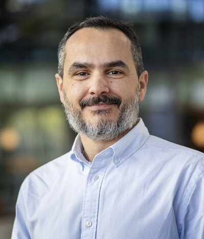
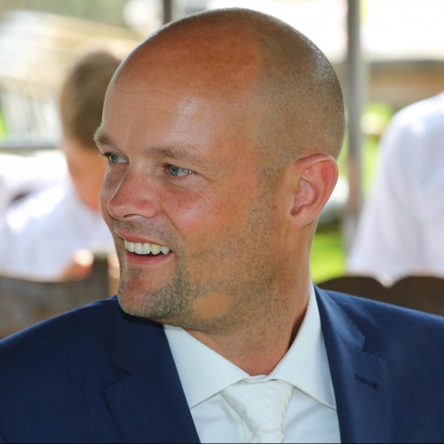
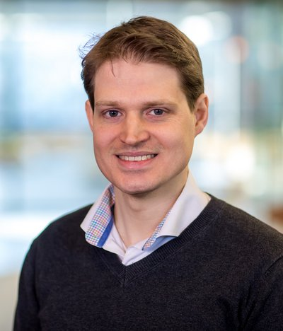
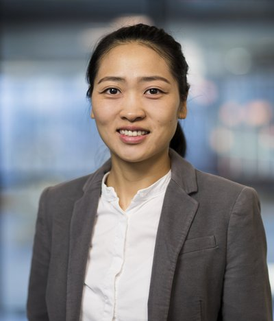

### Spring School 2025

- <figure markdown>
    
    <figcaption>[Vlado Menkovski](https://www.tue.nl/en/research/researchers/vlado-menkovski/){ target=_blank }</figcaption>
    

      Generative modelling for data-driven simulation
    

    <small>April 9, 2025</small>
  </figure>

- <figure markdown>
    
    <figcaption>Evert van Vliet</figcaption>
    

      Computational work at ASML
    

    <small>April 10, 2025</small>
  </figure>

- <figure markdown>
    { width=135px }
    <figcaption>[URE](https://www.universityracing.nl/){ target=_blank }</figcaption>
    

      University Racing Eindhoven
    

    <small>April 11, 2025</small>
  </figure>

### Autumn School 2024

- <figure markdown>
    
    <figcaption>[Frederico Toschi](https://www.tue.nl/en/research/researchers/federico-toschi/){ target=_blank }</figcaption>
    

      How do dense emulsions flow?
    

    <small>November 4, 2024</small>
  </figure>

- <figure markdown>
    
    <figcaption>[Shuxia Tao](https://www.tue.nl/en/research/researchers/shuxia-tao/){ target=_blank }</figcaption>
    

      Modelling of halide perovskites: defects and chirality
    

    <small>November 5, 2024</small>
  </figure>

### Spring School 2024

- <figure markdown>
    
    <figcaption>[Josefine Proll](https://www.tue.nl/en/research/researchers/josefine-proll/){ target=_blank }</figcaption>
    

      HPC for advancing fusion energy - solving the turbulence problem
    

    <small>April 15, 2024</small>
  </figure>
- <figure markdown>
    
    <figcaption>[Ivo Filot](https://www.tue.nl/en/research/researchers/ivo-filot/){ target=_blank }</figcaption>
    

      Multiscale modeling of heterogeneous catalysis
    

    <small>April 16, 2024</small>
  </figure>
- <figure markdown>
    
    <figcaption>[Cassio De Campos](https://www.tue.nl/en/research/researchers/cassio-de-campos/){ target=_blank }</figcaption>
    

      Perspectives for Artificial Intelligence, Tractable Models, Sparse Models, and beyond
    

    <small>April 17, 2024</small>
  </figure>
- <figure markdown>
    
    <figcaption>[Yali Tang](https://www.tue.nl/en/research/researchers/yali-tang/){ target=_blank }</figcaption>
    

      HPC for energy transition - Storage
    

    <small>April 18, 2024</small>
  </figure>

